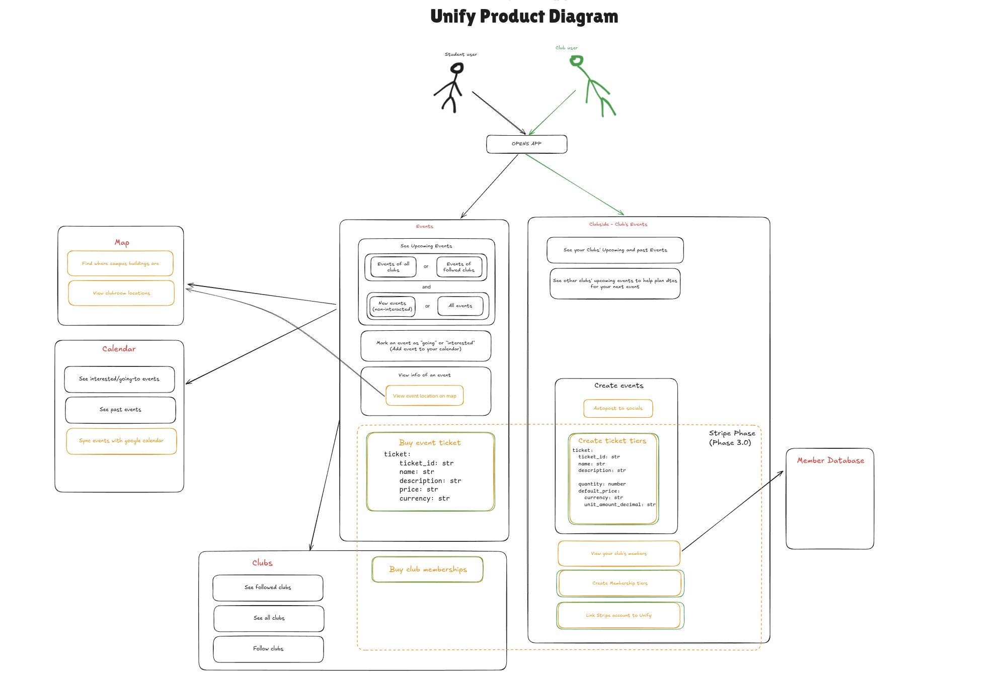

## Architecture and System Overview

This document provides an overview of the system architecture and design of the system. Any developer new to the project
is encouraged to read this document to understand the system's structure and design. Anyone involved with the product stategy
aspect of the project may also find this document useful.

## System Diagram

This  diagram below a high-level overview of the system. You may view it in higher resolution and interactively
by clicking [here](https://excalidraw.com/#json=DMZ-9stR9XuPlxT5i1mRp,63dgRrYOEQz03g3ZgqvaVw).

## Architecture Diagram

*Under progress.*
